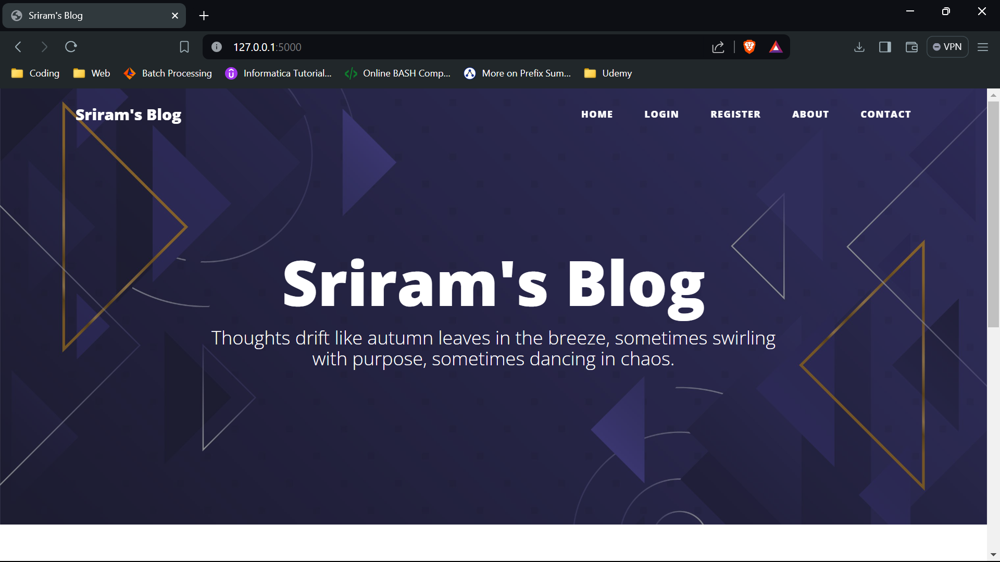
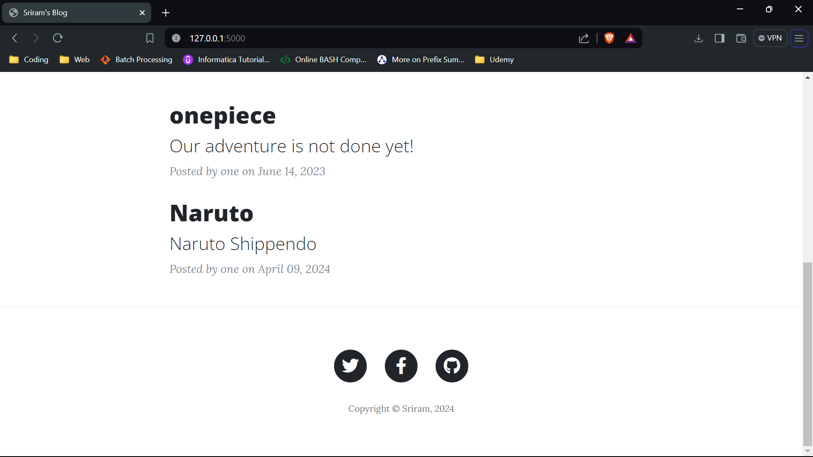
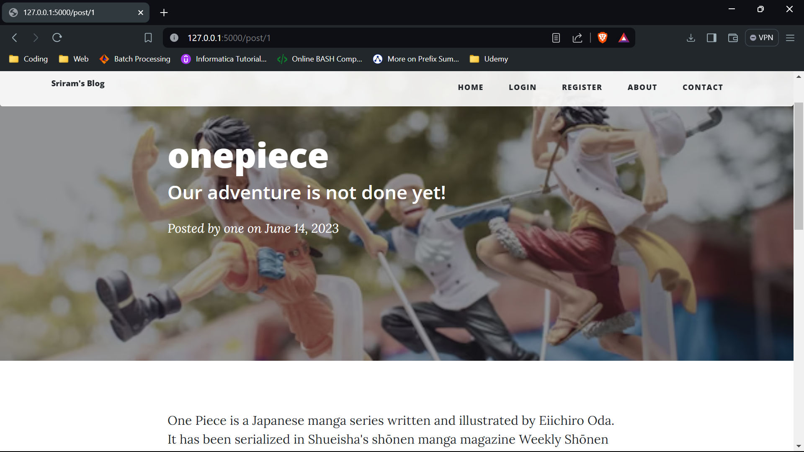
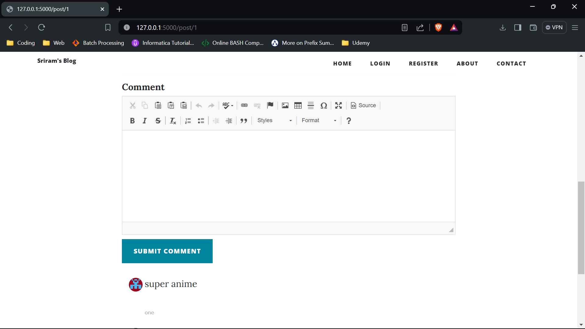
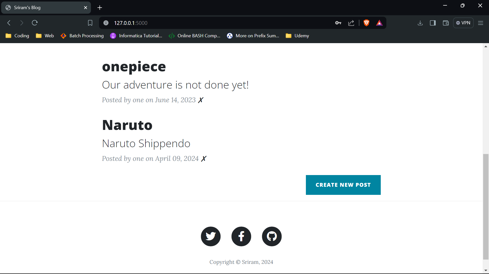

# Blog Website

This is a blog website built using Flask. It utilizes the following dependencies:

## Dependencies

- certifi==2022.12.7
- chardet==3.0.4
- click==8.1.3
- dominate==2.8.0
- Flask==2.3.2
- Flask-Bootstrap==3.3.7.1
- Flask-CKEditor==0.4.6
- Flask-Gravatar==0.5.0
- Flask-Login==0.5.0
- Flask-SQLAlchemy==3.0.3
- Flask-WTF==1.1.1
- idna==2.10
- itsdangerous==2.1.2
- Jinja2==3.1.2
- MarkupSafe==2.1.3
- requests==2.28.2
- SQLAlchemy==2.0.16
- urllib3==1.26.14
- visitor==0.1.3
- Werkzeug==2.3.6
- WTForms==3.0.1

Please ensure these dependencies are installed before running the project.

## Usage

To use this project, follow these steps:

1. Install the dependencies listed above.
2. Run the project using the command `python app.py`.
3. Open your browser and navigate to `http://localhost:5000`.
4. You can view the blog posts on the home page. To add a new post, click on the "New Post" button.
5. To log in or register, click on the "Log In" or "Register" button on the navigation bar.
6. Once logged in, you can edit or delete your posts.

## Pages

- `about`: This page provides information about the blog website.
- `home`: This is the main page of the application. It displays all the blog posts.
- `login`: This page allows users to log in to the application.
- `register`: This page allows new users to create an account in the application.
- `contact`: This page provides a way for users to get in touch with the blog owner.

- As you can see in the sample output images of the website, users and admin pages are different, the code is written such that first logged person in admin, and next are the users.

## Output Web pages

## License

This project is licensed under the MIT License - see the `LICENSE` file for details.

